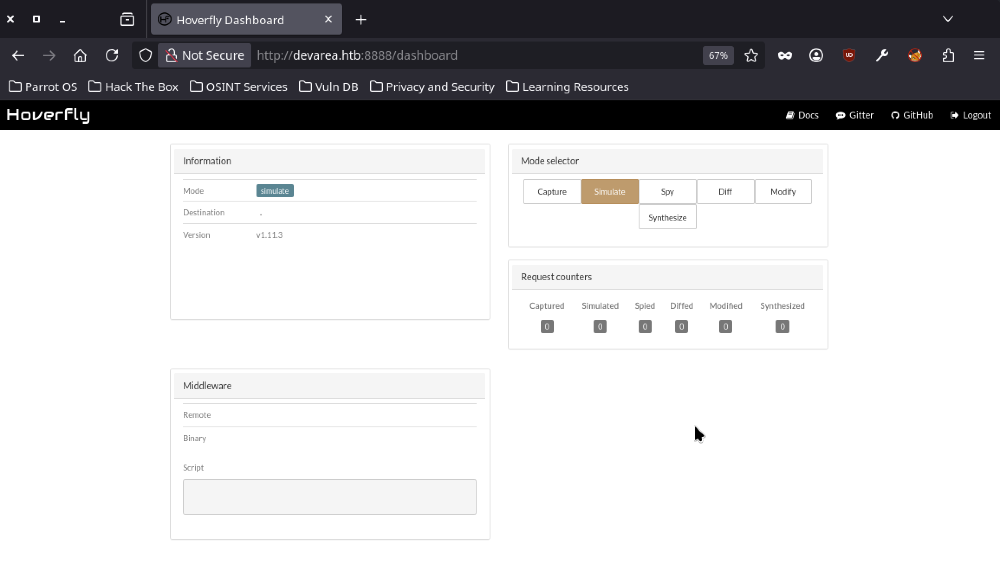
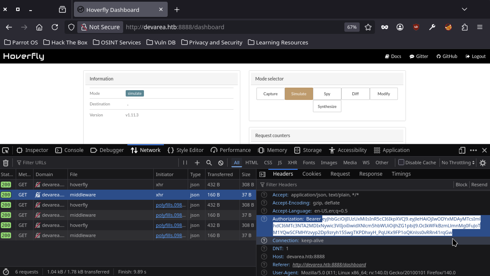
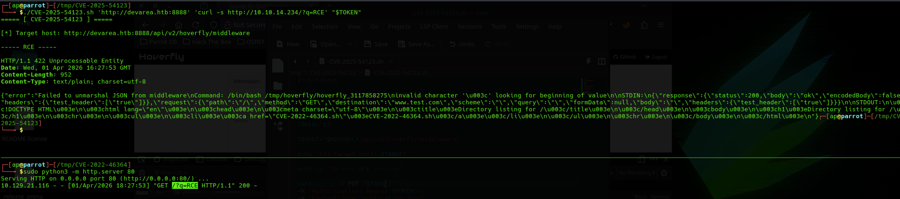

# CVE-2025-54123

A Remote Command Injection vulnerability in Hoverfly (<= v1.11.3) enables **authenticated** **RCE** via the /api/v2/hoverfly/middleware endpoint. The flaw stems from inadequate validation of the *binary* and *script* fields, permitting execution of system-level commands.

This PoC has been verified against Hoverfly v1.11.3 as shown below:


 
Successful exploitation requires a valid API access token (Authorization: Bearer).



```bash
$ ./CVE-2025-54123.sh <TARGET> <COMMAND TO EXECUTE> <TOKEN>
```


